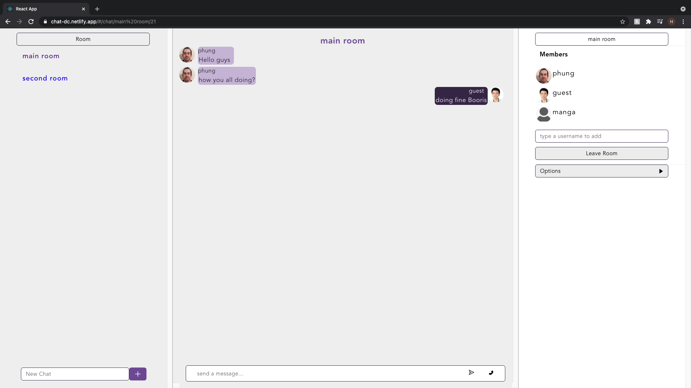

<h1> Gachasphere </h1>



<h2>Summary </h2>

- [About the Project](#about-the-project)
- [Usage](#usage)
- [Videos and Screenshots](#videos-and-screenshots)
- [Getting Started](#getting-started)
- [Built With](#built-with)
- [Accessibility](#accessibility)
- [Authors](#authors)
- [Acknowledgements](#acknowledgements)

## About the Project

Chat-App is a simple video, text chat app that’s built with React, Redux for frontend and Node.js, express, sequelize and PostgresSQL for backend. Live-chat feature is built with Socket.io, live-video-conferencing is handled by WebRTC.

## Usage

To start, visit [Chat-App](https://chat-dc.netlify.app/), register a new account, log into your existing account, or click the login as guest button.

Once you're in, you will be able to create private chatting room or to organize a video conference between members.

## Videos and Screenshots

Click below to see Boris demo Gachasphere:


## Getting Started

To set up a local copy of the project follow the steps below. Be sure to follow the instructions in the [server-side repository](https://github.com/hptran7/chatApp-server.git) as well.

# Prerequisites

- In an empty folder initialize a new Node.js project.

```sh
npm init
```

# Installation

1. Clone to local machine

```sh
git clone https://github.com/hptran7/chatApp-client.git
```

2. Install NPM packages

```sh
npm install
```

3. Start program

```sh
node app.js
```

## Built With

- Javascript
- CSS
- [React](https://reactjs.org/)
- [Redux](https://redux.js.org/)
- [React Redux](https://react-redux.js.org/)
- [Redux Persist](https://github.com/rt2zz/redux-persist)
- [React Router DOM](https://reactrouter.com/web/guides/quick-start)
- [Axios](https://github.com/axios/axios)
- [History](https://www.npmjs.com/package/history)
- [Node.js](https://nodejs.org/en/)
- [Express](https://expressjs.com/)
- [Sequelize](https://sequelize.org/)
- [PostgreSQL](https://www.postgresql.org/)
- [JSON Web Token](https://www.npmjs.com/package/jsonwebtoken)
- [nodemailer](https://nodemailer.com/about/)
- [bcrypt](https://www.npmjs.com/package/bcrypt)
- [Socket.Io](https://socket.io/)
- [Peer-Simple](https://github.com/feross/simple-peer)

### Accessibility

- All navigation and forms are tabbable.
- Text alternatives for images.
- Buttons and links have accessible names.
- Appropriate title, label, and landmark elements, including descending order headings.
- No elements or attributes that would limit use by keyboard or screenreader users.
- Concerted effort to cut down on unnecessary divs, a React/SPA problem.

## Authors

- **Hung Tran** - [hptran7](https://github.com/hptran7)

## Acknowledgements
